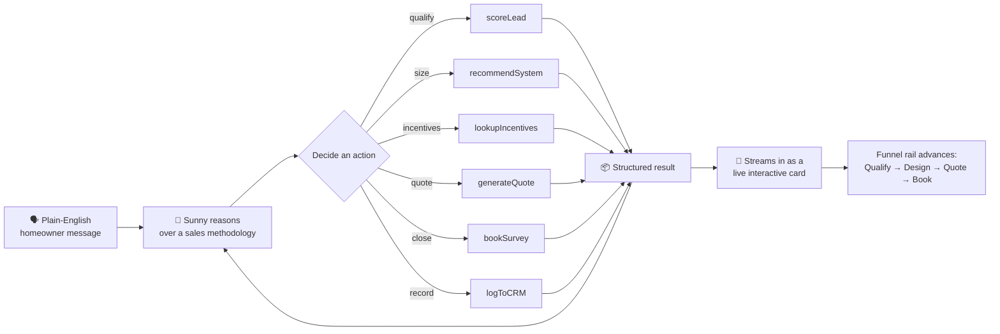
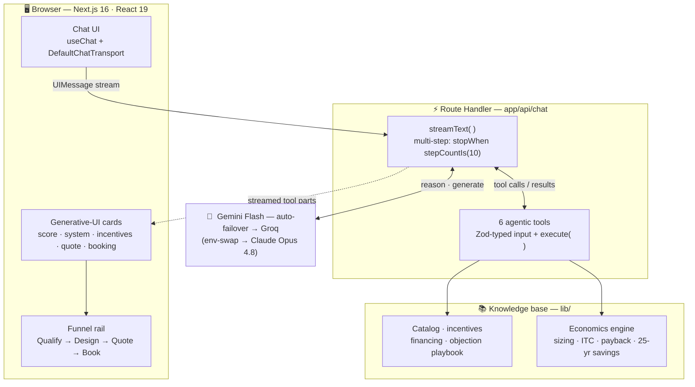
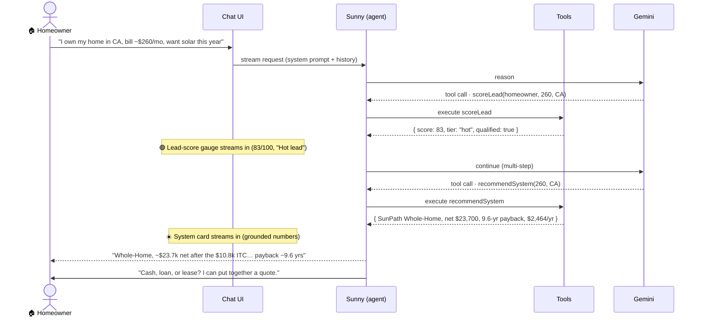
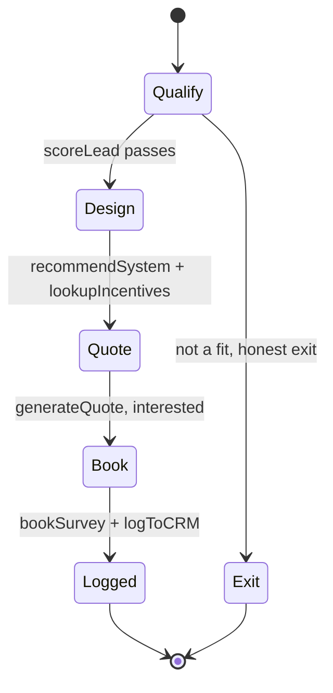
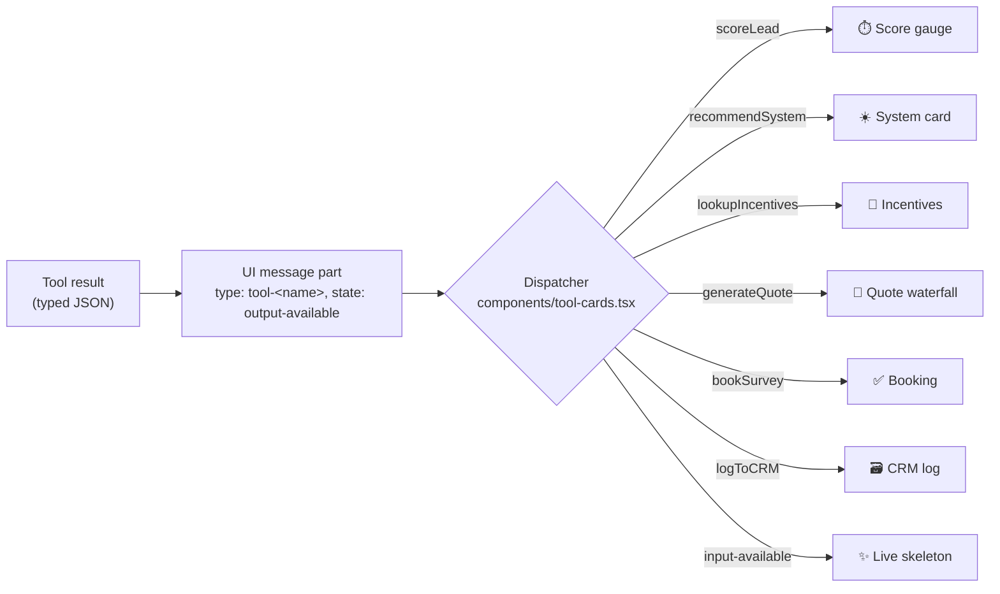
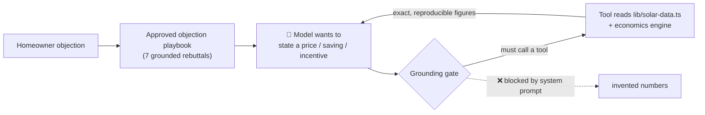
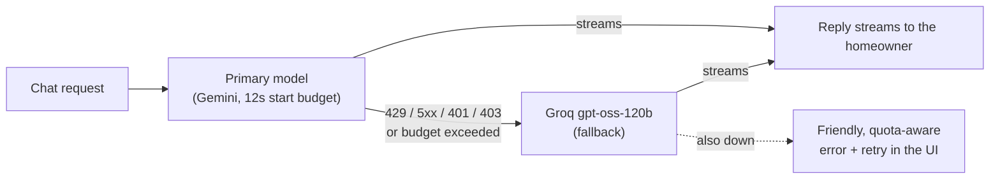
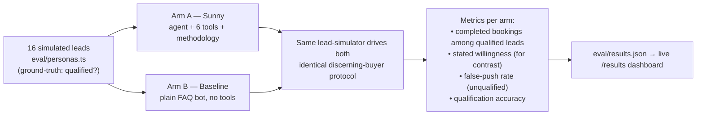

<div align="center">

<a href="https://sunpath-beige.vercel.app">
  
</a>

# ☀️ SunPath Solar

### Meet **Sunny** — an _agentic_ AI solar sales rep that qualifies, sizes, quotes, and **books a survey**, live in chat.

<p>
  <a href="https://sunpath-beige.vercel.app"></a>
  <a href="https://sunpath-beige.vercel.app/results"></a>
  <a href="./DEMO.md"></a>
</p>


**🏆 FlowZint AI Hackathon 2026 · Sales Bot track**

_Not a chat box over an FAQ. An agent that takes real actions — and proves it sells._

</div>

---

> **TL;DR** — Most "sales bots" answer questions. **Sunny runs the funnel.** It qualifies a homeowner, sizes a real system, handles objections with grounded facts, builds a quote, and books a site survey — through **6 tools** and **multi-step tool-calling**, with every action streaming into the chat as a **bespoke interactive card**. It's measured against one number: _booked surveys from genuinely qualified homeowners_, via a reproducible A/B eval.

<table align="center">
  <tr><td><b>🌐 Live</b></td><td><a href="https://sunpath-beige.vercel.app">sunpath-beige.vercel.app</a> — answers even during provider brownouts (automatic failover)</td></tr>
  <tr><td><b>🤖 Agent</b></td><td>6 typed tools · multi-step tool-calling · every action renders as generative UI</td></tr>
  <tr><td><b>📈 Proof</b></td><td>reproducible A/B conversion-lift eval → <a href="https://sunpath-beige.vercel.app/results">/results</a></td></tr>
  <tr><td><b>🧯 Reliability</b></td><td>3-layer tool-call defense · 12s primary budget → Groq failover — each defense born from a failure hit live</td></tr>
  <tr><td><b>✅ Tests</b></td><td>26 unit tests pinning the economics engine and the schema hardening</td></tr>
</table>

<div align="center">

`Qualify` ➜ `Design` ➜ `Quote` ➜ `Book` — and an honest "not a fit" when that's the truth.

</div>

---

## 📑 Contents

- [Why this exists](#-why-this-exists)
- [What makes it agentic](#-what-makes-it-agentic-not-a-chat-wrapper)
- [System architecture](#-system-architecture)
- [How the agent works](#-how-the-agent-works-a-real-turn)
- [The 6 tools](#-the-6-tools)
- [The sales funnel as a state machine](#-the-sales-funnel-as-a-state-machine)
- [Generative UI](#-generative-ui--the-agent-renders-itself)
- [Trust by construction](#-trust-by-construction-no-hallucinated-numbers)
- [Reliability engineering](#-reliability-engineering)
- [Does it actually sell? The eval](#-does-it-actually-sell-the-conversion-lift-eval)
- [Tech stack & why](#-tech-stack--why-each-choice)
- [Project structure](#-project-structure)
- [Quickstart](#-quickstart)
- [Deployment](#-deployment)
- [How it maps to the rubric](#-how-it-maps-to-the-rubric)
- [Design system](#-design-system--twilight-energy)
- [Roadmap](#-roadmap)
- [Disclaimer & license](#-disclaimer--license)

---

## 🔍 Why this exists

Residential solar is a **high-consideration, high-ticket** sale. The bottleneck is rarely the panels — it's the **funnel**:

| Stage | Where deals die |
|---|---|
| **Qualification** | Reps waste hours on renters, tiny bills, and people who won't move — or worse, pressure a bad-fit homeowner and burn trust. |
| **Education** | Buyers don't understand sizing, incentives, or payback, so they stall. |
| **Objections** | "Too expensive," "what about my roof," "I'm moving" — answered inconsistently, often with made-up numbers. |
| **Conversion** | The single highest-value action — booking a site survey — gets lost in a thread of Q&A. |

A generic FAQ chatbot **answers questions**. It doesn't qualify, it doesn't size, it doesn't quote, and it almost never **closes**. SunPath's thesis: the win is an agent that drives the funnel end-to-end while staying honest — and can _prove_ it lifts conversion.

---

## ⚡ What makes it agentic (not a chat wrapper)



Three things make this an **agent**, not a wrapper:

1. **It acts.** Tools have side effects (a quote is generated, a survey is booked, the CRM is updated) — not just retrieval.
2. **It chains.** One user turn can fire several tools in sequence (`scoreLead` → `recommendSystem` → reply) via multi-step tool-calling (`stopWhen: stepCountIs(10)`).
3. **It renders itself.** Each tool result streams into the UI as a purpose-built component — the agent's reasoning becomes a tangible artifact.

---

## 🏗 System architecture



**Separation of concerns is deliberate:** the model decides _what_ to do, the **tools** decide _how_ (and enforce the rules), the **knowledge base** owns the _facts_, and the **UI** turns each action into something a homeowner can see and trust. Swapping the model touches exactly one line.

---

## 🤖 How the agent works (a real turn)

A genuine exchange, captured from the running app:



Note what happened: from **one** plain-English sentence, the agent extracted `{ homeowner, bill, state }`, scored the lead, sized a system with real economics, and drove toward a quote — **two tool calls, two cards, one coherent reply.**

---

## 🧰 The 6 tools

Every tool is a typed function (`Zod` input schema + `execute`) the model can call. The names below are exactly what the model sees.

| Tool | Purpose | Renders as |
|---|---|---|
| 🎯 `scoreLead` | BANT-style qualification → 0–100 score, tier, what's still missing | Animated score **gauge** |
| ☀️ `recommendSystem` | Picks the right package for the bill + computes full economics | **System card** (net price · payback · yr-1 savings) |
| 💸 `lookupIncentives` | Federal ITC (30%) + state-specific programs | **Incentives card** |
| 📄 `generateQuote` | Formal quote with a price waterfall + financing + monthly estimate | **Quote card** (25-yr savings hero) |
| 📅 `bookSurvey` | Books the on-site survey — **the conversion** | **Booking confirmation** |
| 🗃️ `logToCRM` | Records the lead + pipeline stage | System **log line** |

> Tools are the security and honesty boundary: the model can _ask_ for a price, but only `recommendSystem` / `generateQuote` can _produce_ one — and they read it from the knowledge base, never invent it.

---

## 🔁 The sales funnel as a state machine



The `Exit` path is a **feature, not a bug.** Sunny is scored on booked surveys from _well-fit_ homeowners — so a polite "solar won't pay off for you yet" is a success, and the eval rewards it.

---

## 🎴 Generative UI — the agent renders itself

This is the showpiece. In most chatbots, a tool call is invisible plumbing. Here, the AI SDK v7 **UI message stream** carries typed tool parts, and the client maps each to a bespoke React component (with `Motion` entrance animations):



The homeowner doesn't read _about_ a quote — they watch the quote **assemble itself**, line by line, with a 25-year-savings number that animates in. That tangibility is the difference between "a chatbot told me" and "I saw my numbers."

---

## 🛡 Trust by construction (no hallucinated numbers)

The fastest way to lose a high-ticket sale is a number that turns out to be wrong. SunPath makes that **structurally hard**:



- **Numbers** come from the catalog + economics engine (gross → −ITC → −state = net; payback = net ÷ annual savings; 25-yr savings with rate inflation). Same inputs → same outputs, every time.
- **Objections** are answered from an **approved playbook** of 7 grounded rebuttals (cost, payback, roof, moving, aesthetics, reliability, maintenance) — not improvised.
- **Honesty** is a hard rule: the system prompt forbids inventing figures, over-promising utility approval, or pushing a bad-fit homeowner.

---

## 🧯 Reliability engineering

Free-tier LLM infrastructure fails in real, observed ways. **Every row below is a failure we actually hit while building — each one became a shipped defense plus a regression test**, not a disclaimer:

| Failure we hit (for real) | Defense in the code |
|---|---|
| Gemini free tier: `503 — model experiencing high demand`, mid-conversation | **Automatic provider failover** (`lib/model.ts`): the call transparently retries on Groq _before any tokens stream_ — the homeowner just gets an answer |
| A congested primary **stalled long enough to eat the route's whole 60s window** — killing the turn even though the backup was healthy | **12-second start budget**: the primary races a timer on every call; miss it and the fallback serves. Worst-case time-to-first-token is bounded |
| `429 RESOURCE_EXHAUSTED` (daily quota) | **Quota-aware error UX**: the route maps 429s to friendly, in-character copy and the chat UI surfaces it with a retry — never a raw stack trace |
| Models emit `null`, `"240"`, or free text where schemas expected enums/numbers (crashed two eval runs) | **Nullable-everything tool schemas** — `.nullish()`, `z.coerce.number()`, fallback ids — a tool-input validation crash is now structurally impossible |
| Models call tools **before collecting prerequisites** (sizing with no bill, booking with no contact) | **Needs-info steering**: the tool returns `{ needsInfo, message }` so the agent asks the homeowner and retries — the turn is guided, not killed |
| gpt-oss garbled a tool **name**: `logToCRM<\|channel\|>commentary` → `NoSuchToolError` | **Tool-call repair hook** strips the token leak and re-targets the real tool; genuinely unknown names still fail loudly |
| Token-per-day caps abort long eval runs | **Resumable eval**: every conversation checkpoints to disk, re-runs skip finished work, and retries honor the provider's `try again in Xs` hint |



**Verified live — not just written:**
- 🔑 Blanked the Google key (surfaces as `403 PERMISSION_DENIED`) → failover served the reply.
- 🌩️ During a real Gemini brownout, a dead-primary request completed via Groq in **1.9 seconds** end-to-end.
- 🛰️ The production deployment rode out that same brownout serving real traffic from the fallback — invisibly to users.

Failover chain: primary (`SUNPATH_PROVIDER`, default Gemini) → **Groq `gpt-oss-120b`** whenever `GROQ_API_KEY` is set. Kill switch: `SUNPATH_FAILOVER=0`. **26 unit tests** (`npm test`) pin the economics engine and every schema-hardening lesson above.

---

## 📈 Does it actually sell? The conversion-lift eval

Claims are cheap. `eval/run.ts` is a **controlled A/B experiment** that measures whether the agent _converts better than a baseline FAQ bot_.



**What counts as a conversion — completed bookings, not compliments.** A pilot run scored lead-stated *willingness* and the metric saturated: a polite FAQ bot hit **100%** willingness while being unable to book anything. So the headline metric counts bookings that **exist**: for Sunny, a verified `bookSurvey` tool execution (appointment created, name + contact captured); for the baseline, explicit agreement **plus** a contact captured in-chat — it can still convert, it just has to do real funnel work. Willingness is still recorded per arm and shown alongside, because the saturation itself is a finding.

**Why the design is fair:** both arms use the **same model** and the **same lead-simulator**, with one identical discerning-buyer protocol — leads book only after concrete case-specific numbers, their concern addressed, and a proposed next step, and they hand over contact info when agreeing. The **only** variable is the rep. The 16 personas carry a ground-truth `qualified` flag (incl. a renter and a tiny-bill household), so we score not just _did it book_ but _did it book the right people_.

**Run it:**

```bash
npm run eval        # → writes eval/results.json, surfaced at /results
```

It outputs the shape below (run it for live numbers):

```jsonc
{
  "metric":   "completed-booking-v2: …",
  "agentic":  { "convQualifiedPct": __, "willingQualifiedPct": __, "falsePushPct": __, "qualAccuracyPct": __ },
  "baseline": { "convQualifiedPct": __, "willingQualifiedPct": __, "falsePushPct": __, "qualAccuracyPct": __ },
  "liftPoints": __, "relativeLiftPct": __
}
```

> ♻️ **Built to survive free tiers:** the run is **resumable** — every finished conversation checkpoints to `eval/.eval-cache.json`, so a quota interruption resumes instead of restarting, and retries honor the provider's `try again in Xs` hint. The harness is provider-agnostic (`AGENT_PROVIDER` / `LEAD_PROVIDER` / `AGENT_MODEL` / `LEAD_MODEL`), so the full 32-conversation A/B runs free on Groq; `PERSONA_LIMIT` supports smaller smoke runs.

---

## 🧱 Tech stack & why each choice

Every dependency is bleeding-edge **on purpose** — and chosen for a reason, not novelty.

| Layer | Choice | Why |
|---|---|---|
| **Framework** | Next.js **16** (App Router, Turbopack) · React **19.2** | Streaming-native route handlers; Server Components; one runtime for API + UI |
| **Agent runtime** | Vercel **AI SDK v7** (`streamText`, `stopWhen: stepCountIs`, `convertToModelMessages`) | First-class multi-step tool-calling + **provider-agnostic** (swap models in 1 line) |
| **Generative UI** | AI SDK UI message stream → typed `tool-*` parts → React | Tool calls become **interactive components**, not invisible plumbing |
| **Model** | **Gemini Flash** · auto-failover → **Groq `gpt-oss-120b`** · env-swap → **Claude Opus 4.8** | Strong tool-calling at zero cost, resilient to free-tier outages, trivially upgraded |
| **Schemas** | **Zod 4** | Typed tool inputs the model must satisfy; doubles as runtime validation |
| **Styling** | **Tailwind v4** (`@theme`) + **Motion 12** | A custom design system, not a component library; tasteful, GPU-friendly motion |
| **Icons / type** | lucide-react · **Fraunces** display + Geist | Distinctive, non-generic visual identity |

> **Note for reviewers:** the codebase was written against the **installed** type definitions (AI SDK v7, Next 16, Zod 4 differ materially from older majors) — not from memory. It builds clean on the first try (`npm run build`).

---

## 🗂 Project structure

```
sunpath/
├── app/
│   ├── api/chat/route.ts      # the agent loop — streamText + tools + multi-step
│   ├── page.tsx               # the chat experience (+ measured-lift badge)
│   ├── opengraph-image.tsx    # generated social share card (next/og)
│   └── results/page.tsx       # conversion-lift dashboard (reads eval/results.json)
├── components/
│   ├── chat.tsx               # useChat client · message + tool-part rendering · funnel rail
│   ├── tool-cards.tsx         # generative UI — one bespoke card per tool
│   ├── ticker-number.tsx      # count-up numerals (score, savings) — reduced-motion aware
│   ├── stage-rail.tsx         # Qualify → Design → Quote → Book progress
│   └── atmosphere.tsx         # starfield dusk + solar-glow backdrop
├── lib/
│   ├── agent-prompt.ts        # Sunny's system prompt (composed from the KB)
│   ├── model.ts               # provider selection + automatic failover chain
│   ├── tools.ts               # the 6 agent tools (hardened Zod schemas + execute)
│   ├── tools.test.ts          # regression tests for the schema hardening
│   ├── solar-data.ts          # catalog · incentives · financing · objections · economics
│   ├── solar-data.test.ts     # economics engine unit tests
│   ├── tool-types.ts          # shared types mirroring tool outputs
│   └── utils.ts               # formatting + cn()
├── eval/
│   ├── personas.ts            # 16 simulated leads (ground-truth qualified flag)
│   └── run.ts                 # the conversion-lift harness (resumable, provider-agnostic)
└── DEMO.md                    # shot-for-shot demo-video script
```

---

## 🚀 Quickstart

```bash
# 1. Install
npm install

# 2. Add a model key (free — Google AI Studio: https://aistudio.google.com/apikey)
cp .env.example .env.local      # paste your key as GOOGLE_GENERATIVE_AI_API_KEY

# 3. Run
npm run dev                     # → http://localhost:3000

# 4. (optional) run the test suite — economics engine + tool-schema hardening
npm test

# 5. (optional) generate the conversion-lift numbers — free on Groq (console.groq.com)
#    add GROQ_API_KEY to .env.local, then:
AGENT_PROVIDER=groq LEAD_PROVIDER=groq LEAD_MODEL=llama-3.3-70b-versatile npm run eval
```

Build: `npm run build`. The app needs `GOOGLE_GENERATIVE_AI_API_KEY` (default provider); adding `GROQ_API_KEY` enables automatic failover.

---

## ☁️ Deployment

GitHub-linked **Vercel** import (auto-redeploys on push):

1. **[vercel.com/new](https://vercel.com/new)** → import this repo.
2. Framework auto-detects **Next.js** — keep defaults.
3. **Add env vars**: `GOOGLE_GENERATIVE_AI_API_KEY` (primary model) and, optionally, `GROQ_API_KEY` (turns on automatic failover). Keys are _not_ in the repo, by design.
4. **Deploy** → public URL in ~90s.

---

## 🎯 How it maps to the rubric

| Criterion | Weight | How SunPath earns it |
|---|:---:|---|
| **Model Innovation** | **30%** | Genuine multi-step **agentic tool-use** + **generative UI** — the agent _acts_ and _renders itself_, not a Q&A wrapper |
| **Real-World Applicability** | **25%** | A measurable business outcome (**booking lift**) on a real funnel, grounded in defensible economics |
| **Technical Architecture** | **25%** | Clean separation (agent / tools / data / UI / eval), typed end-to-end, public repo, builds clean on a 2026 stack |
| **Documentation** | **20%** | This README + a shot-for-shot [demo script](./DEMO.md) + a self-explanatory `/results` dashboard + a reproducible eval |

---

## 🎨 Design system — "Twilight Energy"

A deliberate, non-generic aesthetic — no Inter, no purple-on-white:

- **Canvas:** deep dusk sky with a warm **solar glow** rising from the horizon, drifting energy rings, a fine grain overlay.
- **Type:** **Fraunces** (optical display serif) against Geist — warmth + precision.
- **Accent:** a sun/ember gradient; a single cool sky tone; a leaf green reserved for savings.
- **Motion:** staggered card entrances, an animating score ring, a celebratory booking check — high-impact moments, `prefers-reduced-motion` respected.

---

## 🛣 Roadmap

- [ ] Publish the headline **conversion-lift number** on `/results` (full A/B run in progress — the harness is resumable)
- [x] Shot-for-shot **demo script** ([`DEMO.md`](./DEMO.md)) — video recording next
- [ ] Final demo on **Claude Opus 4.8** (already wired — `SUNPATH_PROVIDER=anthropic`)
- [ ] **Bilingual** (AR/EN) toggle — the agent already replies in the user's language
- [ ] Voice input (Web Speech) for a hands-free funnel
- [ ] Real CRM / calendar integration behind the `logToCRM` / `bookSurvey` tools

---

## 📄 Disclaimer & license

**SunPath Solar is a fictional installer.** The company, catalog, and customers are invented; all figures are realistic US-market **estimates** used to keep the demo honest, and are confirmed at survey in the narrative. Nothing here is solar financial advice.

Licensed under the **MIT License** — see [`LICENSE`](./LICENSE).

<div align="center">

**Built for the FlowZint AI Hackathon 2026** · _Sales Bot track_

</div>
